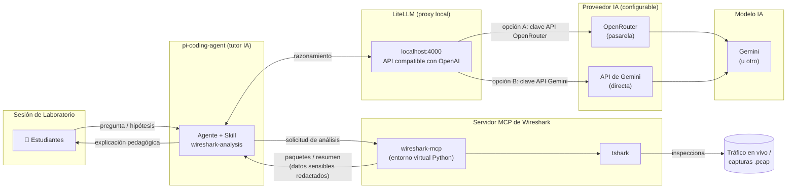

# Tutor IA para el Análisis Guiado de Tráfico de Red

Asistente de IA generativa (basado en [pi-coding-agent](https://pi.dev)) que actúa como tutor de apoyo en sesiones de prácticas de laboratorio de **Redes basadas en IP** y **Sistemas de Telefonía**, capaz de inspeccionar y explicar tráfico de red real —en vivo o desde capturas `.pcap`— conectando siempre lo observado con el concepto teórico correspondiente (modelo OSI/TCP-IP, encapsulación, direccionamiento, control de flujo, etc.).

> Proyecto desarrollado en el marco de la **2.ª Edición de Proyectos Innovadores con IA (Programa GenIA)** — Convocatoria 2026, Universidad de Jaén.

## Contexto Académico

En las asignaturas *Redes basadas en IP* (Máster en Ingeniería de Telecomunicación) y *Sistemas de Telefonía* (Grado en Ingeniería Telemática), uno de los principales retos pedagógicos es la brecha entre la teoría por capas y la lectura de una captura de tráfico real, densa e intuitiva para el estudiante. Este proyecto introduce en las sesiones de laboratorio un agente de IA con capacidades reales de análisis de red (vía MCP + Wireshark/tshark), guiado por su propia metodología pedagógica:

- Siempre parte de un resumen general antes de entrar en el detalle paquete a paquete.
- Vincula cada cabecera con su capa correspondiente.
- Anima a los estudiantes a predecir lo que van a observar antes de capturar.
- Corrige los errores conceptuales explicando el motivo, no solo el resultado.
- Aplica restricciones éticas explícitas: captura únicamente en redes de laboratorio o con autorización expresa, y redacta automáticamente cualquier dato sensible que aparezca en texto claro.

El agente es independiente del proveedor; LiteLLM admite dos modos de configuración para llegar al modelo de IA (véase [Arquitectura](#arquitectura)):

- **Vía OpenRouter** — se usa una clave API de OpenRouter; OpenRouter enruta la petición a Gemini (o a cualquier otro modelo compatible).
- **Vía Gemini directamente** — se usa una clave API de Google Gemini y LiteLLM apunta directamente al endpoint de Gemini.

Cambiar entre modos es una cuestión de configuración (`config.yaml`), no de rediseño.

## Arquitectura



El agente conversa con los estudiantes y, para el razonamiento, delega las llamadas al modelo en **LiteLLM**, un proxy local (por defecto en `http://localhost:4000`) que expone una API compatible con OpenAI. LiteLLM puede reenviar las peticiones al modelo de IA de dos formas:

- **Opción A — vía OpenRouter:** se configura una clave API de OpenRouter en `auth.json` y el endpoint de OpenRouter en `config.yaml`. OpenRouter actúa como pasarela y enruta la llamada a Gemini (o a cualquier otro modelo que soporte).
- **Opción B — vía Gemini directamente:** se configura una clave API de Google Gemini en `auth.json` y LiteLLM apunta directamente al endpoint de Gemini en `config.yaml`. No interviene ninguna pasarela intermedia.

En ambos casos, cambiar de proveedor o de modelo solo requiere editar `config.yaml`, sin tocar el agente. La inspección real de paquetes se delega en el servidor MCP de Wireshark, que envuelve `tshark` para leer tráfico en vivo o ficheros `.pcap`.

## Estructura del Repositorio

```
agent/
├── install-pi-agent.bat        # Instala pi-coding-agent y despliega la configuración completa
├── settings.json               # Configuración base del agente (proveedor, modelo, etc.)
├── mcp.json                    # Definición del servidor MCP de Wireshark
├── auth.json                   # Credenciales del proveedor de IA
├── litellm/                    # Proxy local que unifica los proveedores LLM bajo una API compatible con OpenAI
│   └── config.yaml             # Selección de proveedor: OpenRouter o Gemini directo
└── skills/
    └── wireshark-analysis/     # Skill de enseñanza
```

## Requisitos

- Windows con `npm`/Node.js instalado.
- Python 3 con `venv` disponible en el PATH.
- [Wireshark](https://www.wireshark.org/) instalado (para `tshark`, usado por el servidor MCP).
- [LiteLLM](https://docs.litellm.ai) instalado (`pip install "litellm[proxy]"`) y en ejecución como proxy local.
- Una clave API de un proveedor compatible: **OpenRouter** o **Google Gemini** (véase [Configuración](#configuración)).

## Instalación

Ejecuta `install-pi-agent.bat` desde esta carpeta. El script:

1. Instala `@earendil-works/pi-coding-agent` y `pi-mcp-adapter` de forma global mediante npm (`--ignore-scripts`).
2. Crea `%USERPROFILE%\.pi\agent` y copia `settings.json`, `auth.json` y `skills/` en ese directorio.
3. Genera `mcp.json` con la ruta al entorno de Wireshark, adaptada al directorio del usuario actual.
4. Despliega el servidor MCP de Wireshark: crea un entorno virtual Python en `wireshark-mcp\.venv` e instala el paquete `wireshark-mcp`.

## Configuración

`auth.json` se distribuye intencionadamente con una clave vacía (`"sk-"`). Antes de ejecutar el agente, sustitúyela por la clave del proveedor elegido y configura `litellm/config.yaml` según la opción escogida:

**Opción A — OpenRouter (enruta a Gemini u otros modelos):**

```yaml
model_list:
  - model_name: default
    litellm_params:
      model: openrouter/google/gemini-2.0-flash-001
      api_key: os.environ/OPENROUTER_API_KEY
      api_base: https://openrouter.ai/api/v1
```

**Opción B — Gemini directo:**

```yaml
model_list:
  - model_name: default
    litellm_params:
      model: gemini/gemini-2.0-flash-001
      api_key: os.environ/GEMINI_API_KEY
```

Establece la clave correspondiente directamente en `%USERPROFILE%\.pi\agent\auth.json` tras la instalación, o localmente en este fichero antes de instalar.

## Skills Incluidas

- **wireshark-analysis** — Modo docente: captura y analiza tráfico real (SIP, RIP, OSPF, ARP, DHCP, DNS, TCP, HTTP, TLS...) con fines exclusivamente educativos.

## Contribuidores

Sebastián García Galán, Francisco Javier Maldonado Carrascosa, José Enrique Muñoz Expósito — Departamento de Ingeniería de Telecomunicación, Universidad de Jaén.
