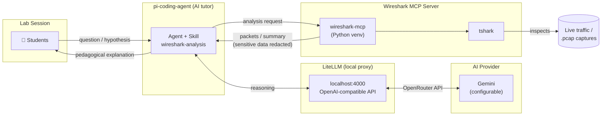

# AI Tutor for Guided Network Traffic Analysis

A generative AI assistant (based on [pi-coding-agent](https://pi.dev)) that acts as a support tutor in hands-on lab sessions for **IP-based Networks** and **Telephony Systems**, capable of inspecting and explaining real network traffic —live or from `.pcap` captures— always connecting what is observed to the corresponding theoretical concept (OSI/TCP-IP model, encapsulation, addressing, flow control, etc.).

> Project developed under the **2nd Edition of Innovative Projects with AI (GenIA Programme)** — 2026 Call, University of Jaén.

## Academic Context

In the courses *IP-based Networks* (Master's in Telecommunications Engineering) and *Telephony Systems* (Bachelor's in Telematic Engineering), one of the main pedagogical challenges is the gap between layered theory and reading a real traffic capture, which is dense and unintuitive for students. This project introduces an AI agent with real network analysis capabilities (via MCP + Wireshark/tshark) into lab sessions, guided by its own pedagogical methodology:

- Always starts with a general summary before diving into packet-level detail.
- Links each header to its corresponding layer.
- Encourages students to predict what they will observe before capturing.
- Corrects conceptual errors by explaining the reason, not just the result.
- Applies explicit ethical constraints: captures only on lab networks or with express authorisation, and automatically redacts any sensitive data appearing in plaintext.

The agent is provider-agnostic (currently configured on OpenRouter); switching to Gemini is a matter of configuration, not redesign.

## Architecture



The agent converses with students and, for reasoning, delegates model calls to **LiteLLM**, a local proxy (default at `http://localhost:4000`) that exposes an OpenAI-compatible API and forwards requests to the configured provider (OpenRouter → Gemini or other). This proxy layer allows switching model or provider by editing only `config.yaml`, without touching the agent. Actual packet inspection is delegated to the Wireshark MCP server, which wraps `tshark` to read live traffic or `.pcap` files.

## Repository Structure

```
agent/
├── install-pi-agent.bat        # Installs pi-coding-agent and deploys the full configuration
├── settings.json               # Base agent configuration (provider, model, etc.)
├── mcp.json                    # Wireshark MCP server definition
├── auth.json                   # AI provider credentials
├── litellm/                    # Local proxy that unifies LLM providers under an OpenAI-compatible API
└── skills/
    └── wireshark-analysis/     # Teaching skill
```

## Requirements

- Windows with `npm`/Node.js installed.
- Python 3 with `venv` available in the PATH.
- [Wireshark](https://www.wireshark.org/) installed (for `tshark`, used by the MCP server).
- [LiteLLM](https://docs.litellm.ai) installed (`pip install "litellm[proxy]"`) and running as a local proxy.
- An API key from a compatible provider (e.g. OpenRouter).

## Installation

Run `install-pi-agent.bat` from this folder. The script:

1. Installs `@earendil-works/pi-coding-agent` and `pi-mcp-adapter` globally via npm (`--ignore-scripts`).
2. Creates `%USERPROFILE%\.pi\agent` and copies `settings.json`, `auth.json`, and `skills/` into it.
3. Generates `mcp.json` with the path to the Wireshark environment, adapted to the current user directory.
4. Deploys the Wireshark MCP server: creates a Python virtual environment at `wireshark-mcp\.venv` and installs the `wireshark-mcp` package.

## Configuration

`auth.json` is intentionally distributed with an empty key (`"sk-"`). Before running the agent, replace it with your key from the provider configured in `settings.json`, either directly in `%USERPROFILE%\.pi\agent\auth.json` after installation, or locally in this file before installing.

## Included Skills

- **wireshark-analysis** — Teacher mode: captures and analyses real traffic (SIP, RIP, OSPF, ARP, DHCP, DNS, TCP, HTTP, TLS...) for exclusively educational purposes.

## Contributors

Sebastián García Galán, Francisco Javier Maldonado Carrascosa, José Enrique Muñoz Expósito — Department of Telecommunications Engineering, University of Jaén.
