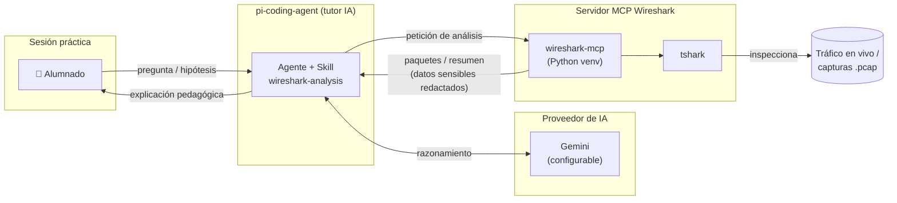

# Tutor de IA para el análisis guiado de tráfico de red

Asistente de IA generativa (basado en [pi-coding-agent](https://pi.dev)) que actúa como tutor de apoyo en sesiones prácticas de **Redes basadas en IP** y **Servicios de Telefonía**, capaz de inspeccionar y explicar tráfico de red real —en vivo o desde capturas `.pcap`— conectando siempre lo observado con el concepto teórico correspondiente (modelo OSI/TCP-IP, encapsulado, direccionamiento, control de flujo...).

> Proyecto desarrollado en el marco de la **II Edición de Proyectos Innovadores con IA (Programa GenIA)** — Convocatoria 2026, Universidad de Jaén.

## Contexto académico

En las asignaturas *Redes basadas en IP* del Máster en Ingeniería de Telecomunicación y *Servicios de Telfonía* del Grado en Ingeniería Telemática, una de las principales dificultades didácticas es la distancia entre la teoría por capas y la lectura de una captura de tráfico real, densa y poco intuitiva para el alumnado. Este proyecto incorpora a las prácticas un agente de IA con capacidades reales de análisis de red (vía MCP + Wireshark/tshark) guiado por una metodología pedagógica propia:

- Parte siempre de un resumen general antes de entrar en el detalle de paquete.
- Relaciona cada cabecera con su capa correspondiente.
- Anima al alumnado a predecir qué va a observar antes de capturar.
- Corrige errores conceptuales explicando el motivo, no solo el resultado.
- Aplica límites éticos explícitos: solo captura en redes de laboratorio o con autorización expresa, y redacta automáticamente cualquier dato sensible que aparezca en claro.

El agente es independiente del proveedor de IA (actualmente configurado sobre OpenRouter); el cambio a Gemini es una cuestión de configuración, no de rediseño.

## Arquitectura



El agente conversa con el alumnado y con el proveedor de IA para razonar, mientras delega la inspección real de paquetes al servidor MCP de Wireshark, que envuelve `tshark` para leer tráfico en vivo o ficheros `.pcap`.

## Estructura del repositorio

```
agent/
├── install-pi-agent.bat         # Instala pi-coding-agent y despliega toda la configuración
├── settings.json                # Configuración base del agente (proveedor, modelo, etc.)
├── mcp.json                     # Definición del servidor MCP de Wireshark
├── auth.json                    # Credenciales del proveedor de IA
└── skills/
    └── wireshark-analysis/      # Skill docente
```

## Requisitos

- Windows con `npm`/Node.js instalado.
- Python 3 con `venv` disponible en el PATH.
- [Wireshark](https://www.wireshark.org/) instalado (para `tshark`, usado por el servidor MCP).
- Una API key de un proveedor compatible.

## Instalación

Ejecuta `install-pi-agent.bat` desde esta carpeta. El script:

1. Instala `@earendil-works/pi-coding-agent` y `pi-mcp-adapter` globalmente vía npm (`--ignore-scripts`).
2. Crea `%USERPROFILE%\.pi\agent` y copia en él `settings.json`, `auth.json` y las `skills/`.
3. Genera `mcp.json` con la ruta al entorno de Wireshark, adaptada al directorio de usuario actual.
4. Despliega el servidor MCP de Wireshark: crea un entorno virtual de Python en `wireshark-mcp\.venv` e instala el paquete `wireshark-mcp`.

## Configuración

`auth.json` se distribuye con la clave vacía (`"sk-"`) a propósito. Antes de ejecutar el agente, sustitúyela por tu clave del proveedor configurado en `settings.json`, directamente en `%USERPROFILE%\.pi\agent\auth.json` tras la instalación, o localmente en este archivo antes de instalar.

## Skills incluidas

- **wireshark-analysis** — Modo profesor: captura y analiza tráfico real (SIP, RIP, OSPF, ARP, DHCP, DNS, TCP, HTTP, TLS...) con fines exclusivamente didácticos.


## Participantes

Sebastián García Galán, Francisco Javier Maldonado Carrascosa, José Enrique Muñoz Expósito — Departamento de Ingeniería de Telecomunicación, Universidad de Jaén.
